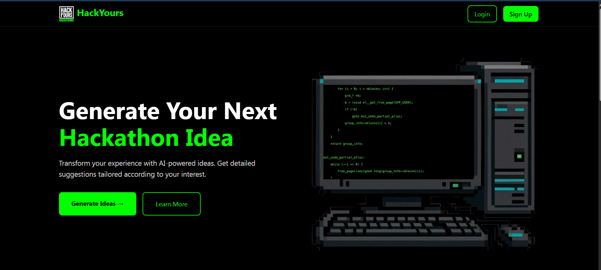
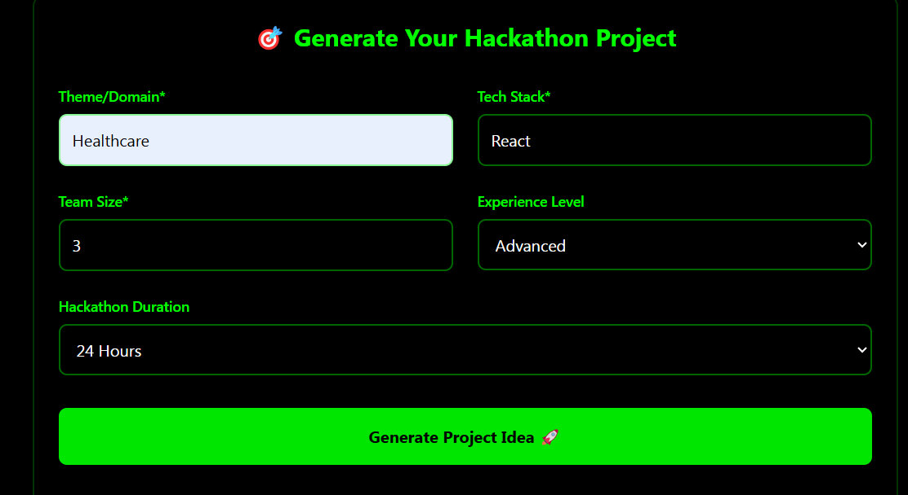
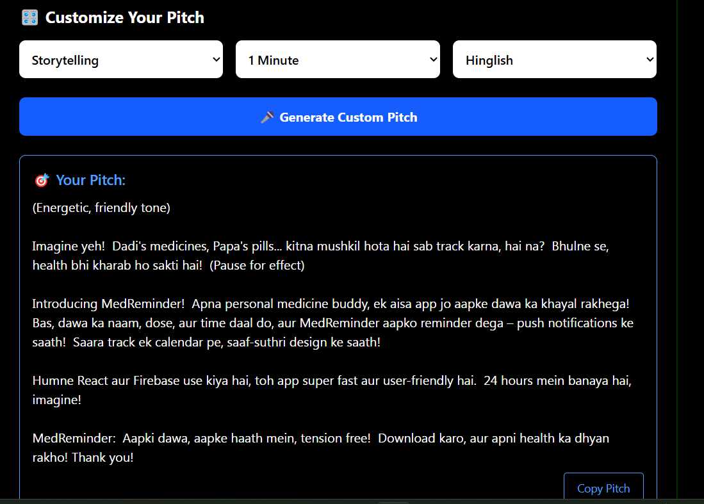

   # 🚀 HackYours - AI-Powered Hackathon Companion

HackYours is your ultimate hackathon assistant — an AI-powered platform that helps developers, students, and innovators ideate, pitch, and plan hackathon-ready projects in minutes. Built during a hackathon by Team Binary Brains, this tool streamlines your journey from *"What should we build?"* to *"Let’s ship it!"* — with the help of Google’s Gemini AI.

---

## 🌟 Features

- 💡 **AI Project Idea Generator** — Based on domain, tech stack, team size & difficulty
- 🧠 **Prompt Generator** — One-click prompt to rebuild the entire project via LLMs like Gemini or ChatGPT
- 🎤 **Pitch Generator** — Customizable pitch with tone, language, and duration control
- 💾 **Save Ideas & Prompts** — Store your ideas with implementation roadmap and prompt
- 🖼️ **Responsive UI** — Sleek, dark-mode-friendly interface with smooth Framer Motion animations

---

## 🔥 Live Demo

🌐 **Try it now** → [hackyours.raghavkatta.xyz](https://hackyours.raghavkatta.xyz)  
💻 **GitHub Repo** → [github.com/raghavxkatta/HackYours-BinaryBrains](https://github.com/raghavxkatta/HackYours-BinaryBrains)

---

## 🛠️ Tech Stack

| Tech          | Usage                         |
|---------------|-------------------------------|
| React.js      | Frontend framework            |
| Tailwind CSS  | UI styling                    |
| Framer Motion | Animations                    |
| Vite          | Build tool                    |
| Gemini 1.5 API| Project idea & prompt generation |
| Context API   | Global state management       |

---

## 📸 Screenshots

> 




## ⚙️ Getting Started

### 1. Clone the Repo

```bash
git clone https://github.com/raghavxkatta/HackYours-BinaryBrains.git
cd HackYours-BinaryBrains
2. Install Dependencies
bash
Copy
Edit
npm install
3. Set Up API Key
Create a .env file in the root:

env
Copy
Edit
VITE_GEMINI_API_KEY=your_gemini_api_key
Get your key from: https://makersuite.google.com/app/apikey

4. Run the App
bash
Copy
Edit
npm run dev
🧩 Folder Structure
css
Copy
Edit
src/
├── components/
│   ├── PitchGenerator.jsx
│   ├── PromptGenerator.jsx
│   └── Toast.jsx
├── pages/
│   └── IdeaGenerator.jsx
├── services/
│   └── storageService.js
├── utils/
│   └── generatefromGemini.js
├── App.jsx
├── main.jsx

🧑‍💻 Contributors
@raghavxkatta
@JustPratiyush
@rainyyyyshrrr12
@diyashuklaa


Built during Hackstreet Hackathon By Team Binary Brains 💻🔥
